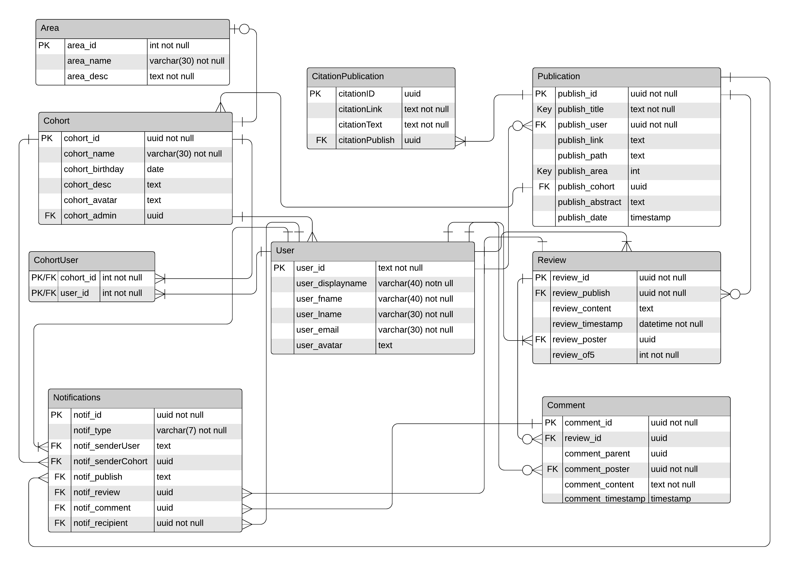

# PeerView: A Peer Review Web Application


## Setting Up the Application

In order to begin using the application, clone it from the GitHub repo.
Once done, navigate to `/appeng2020-UP938828` in a terminal and run the command `npm i`.
Once this has finished, run the command `npm run setup` to setup the PostgreSQL database on your system. It is pre-populated with tasteful dummy data for demonstration purposes.

* If `npm run setup` fails on your system, please delete the "user" and "password" fields from `data/config.js` and try again. You may need to enter your PSQL user password a few times to get the installation complete.

Once the database is fully installed, run the command `npm run start` to start the app server. In a web browser, type `localhost:8080` in the address bar, and get started!

## Key Features of PeerView

The application - at the time of handin - currnetly supports:

* Google OAuth2 - sign in with Google to create your account, then customise your display information on 'Your Account'.
* Publication Uploading - Upload your own publication to open reviews and comments from the public! Maybe they'll even be nice about it?
* Publication Browsing - View the list of the most recently uploaded publications, or browse those uploaded by yourself, other users and cohorts.
* Reviews and Comments - You can rate publications out of 5 and can leave a helpful review in the review list. People can comment on this review, and you can reply to their comments, for a comment thread. Hopefully there's some useful insight in there (but keep in mind it's a discussion thread on the internet!)
* Searching - Search for an entity by name. Refine your search by publication title, academic area, cohort name or user name.
* Cohorts - Groups of users who can choose to post publications under their group title. Cohorts are invite-only; any user in a cohort can send invites out, but only admins can remove users.
* Notifications - When someone reviews your publication, replies to your comments or invites you to a cohort, you'll see a new notification in the sidebar on the right. Here you can navigate to the page, accept invites, or ignore the notification.

## PeerView Design, Structure and Layout

Please see `/api.md` and `/architecture.md` for written descriptions on how the app handles data requests and how file structure is laid out. Shown below is the Entity-Relationship Diagram of the final version of the database used in the app, and you can also find wireframes for planned UI design in `/wireframes`, though these may not reflect exactly the UI of the final product.



## Plans for future/unfinished features

* Instant Messaging

I had planned to include a chat function into the app from the start, specifically tailored towards cohorts, reminiscent of Discord/Slack chat channels. This would allow cohorts and their members to chat in rooms and discuss their latest revews and papers. It got scrapped because of time constraints.
I feel it would not be too hard to implement per se; I setup the websocket notifications system to give alerts to anyone who needed them, and all it would need to implement message alerts is an extra field in the websocket message frame. Then implement the chat window (no easy feat) and make a new table in the database to house the messages and done!

As an extension, the websocket server opens opportunity for more notifications in general. I wouldn't want to go overboard with them, as they could detract from the user experience and cause annoyance. But there are some important occurences that can affect a user that presently they just won't know about, such as being kicked from a cohort, or when someone in the cohort publishes a paper. But again, it wouldn't be too much of a stretch to do it.

* Comment/Review/etc Editing

At time of handin it is not possible to edit the content of a review, comment or citation once it has been added. The only way is to delete it, and re-add it. I kept apps like Youtube in mind when designing this comment thread system, as I feel they implement it very well, and you can edit comments through a small pop-up box that appears when you click Edit. However in the time I had left this proved too difficult to implement and was left out to meet the deadline.
To implement it, I'd imagine all that would need to happen is a tweaking of the template to include a hidden text input area + 'submit' button, then implement their functionality. Personally I did not find the time to implement it, however I'm sure someone of greater skill than me could with not much hassle.

* Custom Academic Areas, and greater Area power

The current list of 10 academic areas (including but not limited to Madladdery) are just examples attached the data to demonstrate the ability's function. However I didn't end up doing much with it; I'd orginially intended for people not only to be able to search the *entire* catalogue of Areas, but for people to be able to submit their own Areas of Expertise, as I'd feel any limits that I or anyone would put on the list would upset some hypothetical users due to a lack of representation.
I really toiled with it for a while, but I couldn't figure out a way to automatically vet this type of input. These areas would be accessible by everyone and, while I do understand that our hypothetical audience are hypothetical academics, nothing on the internet is sacred and I could see the system being up for abuse. (Such as putting Madladdery as an academic area of expertise)
In a similar vein of thinking, I nearly removed the ability to upload a Publication as an external link, due to the possibility of user security risks, but when re-reading the mark scheme that was listed as a core capability, so.
As it stands with the app, you can't filter/search by area or add new ones, just attach them to your paper for display when they are being inspected. To remedy this, find either a content-filtering/moderating system or a more exhaustive list of academic areas, and add another button to the search bar.

* Better Assets/SVG Integration

The graphic assets in the app are either created by me or are free for usage in the public domain. I attempted to get them all to function properly as .svg graphics, but decided against it after I'd noticed how much time I'd spent unsuccessfully trying. SVGs are nicer in that they scale better, are smaller in filesize, are generally more widely compatible and play somewhat nicer with CSS colour filtering than other image types.
I was also in talks with a friend from Leeds University about commissioning a higher-quality logo from him, but these talks fell through when he couldnt' fit the time in around his commission schedule before my deadline.
Ideally, I'd like more of the interactibles in the app to just look *nicer*, rather than be styled divs with text in them. In addition, updates to the logo and other app assets would be good to see.

## Reflection

During development, I kept what I suppose is a development diary, where I actively noted large changes/decisions made - and my reflections upon them - in real time as I was developing the app. I decided to include it in this section as I think it very purely captures how I thought, felt and changed throughout making the app. It's quite long, so I've also included a "too long; didn't read" summary at the bottom of this file.

### Initial plans

See `docs/formative`.

### Subsequent Plans and Progress

This section will be updated over development, so I can track where I differed from my initial plans and reflect on these changes.

After peer`ha`ing over my initial plans and actually trying to implement them, I've decided to change some elements of the webapp to better suit not only what I can implement, but also to better suit the user experience.

* The instant messaging feature is on the backburner. It will be implemented if the time can be found, however it's not necessary to the core user experience, and as such is not a priority.
* Simplified the navigation of the site and integrated previously standalone features more seamlessly into sensical locations (eg reviews not being a standalone page, but instead only appearing alongside publications)
* Decided to implement OAuth instead of a password system after the AppEng lecture on it. Seems very secure and easy to use for users, hopefully easy to develop with too.

I've also thought over the api design and decided that `routes.js` is an unnecessary step for any data requests to take; as such the file is deleted and all database requests will be handled by `server.js`, using pre-defined PSQL queries in `query.js`.

I have decided to refactor the current program into TypeScript. The challenge of doing so is enormous, especially since I'm not majorly familiar with its conventions, but I think it will be a good learning challenge and may even let way for some improvements to the program.

After a long time spent trying to get the app functional in typescript, I have decided against it, and have decided to revert it back into Javascript in order to make the deadline. It would have been wiser to start the project in Typescript, rather than refactor it later.
At the time of writing, my part-time work involves maintaining a mobile application using React Native and Typescript, which gave me the confidence drive to at least attempt the refactor.
It wasn't a complete waste of time! I learned more in depth about static typing and how fast and loose Javascript truly plays it with typing.
Through this experience, I decided that creating rigid object skeletons for data transfers would be beneficial, as it meant that throughout all transactions, I could manage and fixate all data types involved, and avoid any headache that woukd arise when less rigid transfers eventually error'd out.

I have refactored the client folder to fit a development architecture called Model View Controller (MVC). This would have been wise to do from the start but will assist me going forward with the project.
The Model (`data/model.js`) will manage data and operations performed upon it, the View (`client/view.js`) will hold manage drawing and manipulating page elements and the Controller (`client/controller.js`) will manage passing data between the view and model, and processing data in the background such as filetype validation and websocket requests.
What is fun is that earlier in development I deleted `routes.js`, deeming it an unnecessary for data transfers, just to bring it back under a different moniker. Maybe I had even tried to create an MVC structure at the start without really realising it!
After filling some of the files it is clear that it's perhaps not the most efficient way to go about it (data from server requests gets passed through 3 files through quite similar functions).
However, I think it'll benefit the app greatly from a code readability, structure and general maintainability front as segmenting code and functions appropriately will allow me (+developers) to quickly scroll to code with issues and improve ability to log. (i'm most pleased at how `index.js` won't be 5k+ lines long or something).

I have made changes to the database to better suit the current vision of the app. The `userArea` and `publicationSources` tables are gone; this is due to the removal of the many-many relationship I thought was needed when planning the app, but when developing the app I decided to simplify it.
It made more sense to just lock a publication to an Area, rather than users as well; I wouldn't want to be locked to one academic area.
`Sources` are now known as `Citations`; besides the name being clearer, removing the many-many relation here made sense as, though it may lead to duplicate entries in the table, having the many-many could lead to wrongful manipulation of Citations, the effects of which would appear on more than one publication if the relationship stayed as is.
I have also added a `Notifications` table to store the notifications; I had imagined them being a session-based thing, so not needing to be expressly stored.
However I thought it would benefit the user more if they could scroll through old ones, and if the notifications list could be populated with notificatios from before the session.
This realisation occurred when I accidentally logged into Facebook for the first time in over a year, and saw the backlog of notifications I had accrued over a year of inactivity.

All of the http routes have been completed and a websocket server has been created, though it is yet to get functionality.
The database has been fully initialised in its final state (probably), complete with an appropriate range of dummy data to (hopefully) well demonstrate the capabilities of the app. All dummy data is either in the public domain, free for public use/reference/parody or fictitious (or hilariously funny).
I also decided to implement an `offset` system into most of the 'GET' requests for the app. When peering over my Dog Tinder project, I'd realised that not only was it complete crap, but I'd also left scalability completely out of the question.
I thought about how, if this app were actually deployed and got popular, how big the data sets could become if I was simply getting *every* row from a table in a request; it would absolutely chug the client and requests would be enormous.
I discovered that PSQL supports retrieving data later in a list: the `offset` parameter, and stopping before it scrolls the entire table: the `limit` parameter.
So for populating lists of citations, publications, users etc, they all now have a limit of 20 and an incremental offset, that increments by 20 everytime it is used, and resets to 0 when the list/element is removed/changed.

Jest testing has been implemented for some of the PSQL functionality in the app `data/tests`. Due to a lot of the queries being quite similar, and me verifying they are all formatted correctly through extensive error message reading, I so far only wanted to test enough of a range of queries to test that all data/request types function as intended.

Work begun on lofi versions of the page. These lofi versions will allow me to roughly structure a page and test input validity and functionality. Once the skeletons are in place, styling can begin.
Styling work had to be done at this stage in the development; even though I'd rather leave it until last, doing it now helped me organised page elements that were conflicting and overlaying due to the differences in my desired layout and what I'd actually written in HTML.

The lofi pages are finished, input validation and information loading testing has begun. Implementing the ability to upload a PDF or a link has been a bit of a pain, but I think I'm there. My biggest concern with something like this is security; actual users can absolutely post malicious links to the website and there's very few if any ways to validate them when they're posted.
It is however, in the mark scheme to allow this functionality. I think I'll implement a page warning on all external click events to inform the user that links have the potential to be unsafe.
I decided to create a mass file that will grab all of the page elements `client/elements.js` and export them to `client/view.js`. The words 'querySelector' are scarred into my retina. But it saves me from writing them much further.

The way the application authenticates users as themselves has had to change heavily; for the better, but also for a relatively big reason.
When setting up the *entirety* of the HTTP route system, I had been using the OAuth id_token as the Authorisation token to grab and use an id number for my database, which is good practice; it authenticates the client to the server.
This meant I could compare the `req.user.id` from the request with the stored database ID for authentication. However; I had been storing the idtoken in localStorage, which is pretty simply not good practice.
Even then, I hadn't considered a way to authenticate from the server to the client, which is pretty key to page rendering based on authentication.
Initially I tried using HTTP Trailers, which are packets of information you can attach after the request has been sent to the client; after many attempts, I learned that node-fetch patched this out last year.
The auth system has changed so that authentication is performed on the clientside *after* a server request, and that the idtoken is called only when necessary.
However since this escapade got me reading into the browser's local and session storage, I thought I'd make better use of it; I've implemented a rudimentary dark/light mode to the app using local storage, and am using session storage to track page ids, cohort ids, etc.
It would have saved hours of headache to just read how to do auth securely and properly (and to read the documentation), but at least I know now. And knowing is half the battle~

I have added some Jest testing to test that functions in `client/view.js` work as intended. I didn't know that Jest could test DOM elements or webpage functionality, but people from my SETAP group showed me how to do that.
I'm not sure how much coverage I'll be able to get with this; so far I only plan to test that elements hide/show correctly on certain auth conditions.

I was looking into different alert box formats, instead of using the javascript default library. I'd had this belief that they were bad from a usability front, but uptodate research and browsers seems to disagree? `https://accessibility.psu.edu/scripts/alertboxes/#basic` `https://css-tricks.com/comparing-the-different-types-of-native-javascript-popups/`
They seem to play nicer with screen readers and have more support than they used to. So will keep the default alerts in place for error reporting at the minimum, but will investigate alternatives for information reporting.

Managed to create a way to condense *all* of the HTTP-related queries in `client/controller.js` into *two* functions! Saves having a list of pushing 40 functions in more than 2 places. This was achievable because the input and output of all of them was homogenisable enough to be able to justify it.
The server side of these functions hasn't been condensed quite as far; the inputs have had to remain untouched, however the error/output handling have been simplified into two functions each in `data/model.js` and `data/server.js`.

Further factored the view down into two files, located in `client/view`. `pages.js` will load and populate all main page elements, and set up some listeners. `view.js` will control displaying and switching these pages, alongside the more ancillary page functions, such as appload events, most event handlers and sidebar functions. This was done to stop the view file, which had already been factored, being 1000 lines long.

Reworked the database to use a PSQL connection pool. This is a scalability feature; it's better suited for multiple concurrent connections to a PSQL database, as would fit a webapp such as this. Again! Another thing I should have read up more on before implementing it! But here we are now, and it works very well.

The notification system is functioning! I've rarely been prouder of something. I know I'd had that last on the list for priorities, but it's future-proofed and optimised enough such that I'll be able to develop further alongside dipping the notification functionality in tandem.

The users page is done. Through the monumental effort it took me due to having to rework a lot of how the page reads/receives data, I'm hoping that the cohort and publications pages, which aren't too dissimilar to the user pages, won't take as much time. It's a blessing and a curse that I built my backend up for so long thinking that it was bulletproof; obviously dreams never come true, but where the inevitable issues arose, I feel my careful planning of it all has made fixing these erros that bit easier. Or maybe it was causing them in the first place? Who knows~

The publication pages are done. Something I hadn't thought about until it was too late was event listeners. Since my approach to pages has been to have them built, add all events and then show the page, then to merely hide the whole page when not needed (rather than destroy/create pages on view), they don't lose their event listeners. And due to a lot of them using anonymous/arrow functions, they'll never override the previous listener.
So the workaround I have for more permanent page elements is to attach a `click` class to them all when they first get an event listener, then check for it on subsequent listener add attempts; it looks like this:

```js
if (!elemenet.classList.contains('click')) {
      element.classList.add('click');
      element.addEventListener('click', async () => {
```

Not only does this look disgusting, this isn't good from a scalability outlook, since working with this means is not only annoying but would require more individual classes. But this is what happens when you get this far and have negative-value foresight.
Where I remember to, I'll use an easier way to add event listeners. I'll go back and change it all if I get the time. What this is really is an exercise in typing and data integryity; this convenient practice isn't universally applicable due to its volatile way of handling data. Who knew?
Through some further testing both methods seem to be inconsistent. So I'll intersplice them when necessary.

As a small change, but big change to way of thinking; until now, in `server.js`, I had used a single global variable, `query`, to pass around the functions for query strings. This isn't the *worst* thing to do on a client-side, and honestly it made the code look a teeny bit nicer. But if, in a hypothetical future, this app is running on a server with 50 concurrent connections and they all have to share that one poor variable for *every* incoming request?
Something would give at some point. At least, that's how I'd imagine it happening. Maybe I'm massively underestimating it all? But online help such as `https://stackoverflow.com/questions/23830009/are-global-variables-in-node-js-server-wide-or-just-for-that-session-or-user` suggests that exactly what would happen. So decided to localise all the server-side variables to avoid such a thing from occurring.
Not like the internet would ever lie(!)

It is now about too late into development to make big changes. It is also now I've decided that it would have been better all along to generate my own UUIDs, rather than let the database take care of it when inserting records.
Updating pages and records with stuff the user has such done, such as reading a review they've just posted or attaching citations to a brand new paper, is infinitely more awkward when you have to re-query the database with fresh, volatile information just to get an ID back, than just generating your own IDs and dealing with the miniscule possibility of dealing with id clashes.
If I could go back and do that from the start, I would. But presently that's just too much of the app to rewrite and bug text.
Other regrets currently include not writing more comprehensive documentation on my own API (the amount of staring at error codes is getting a bit silly) and the scope for the app I've decided to keep this late into development; it's too much too late.
I have now seen some colleague's work so far and I feel that, whilst my work is not as technologically sound as theirs, that I've push the boat out a bit feature-wise; this has been a fun challenge but also started to become a massive source of stress a while ago.
I was worried that I wasn't making enough progress compared to my colleagues - or even just overall - but now I get the sense I've just given myself too much to do. I've had to drop the ability to edit reviews and comments for time purposes. I'm convinced I won't have to drop more features, and can comfortably complete the rest of the app in the time left.

### Too Long; Didn't Read

Through developing the app, it became clear to me that the largest obstacle in the development process was a lack of depth-y planning, and research into software paradigms I was planning to use.
I had planned UI designs, interaction flows, even a complete relational database to serve all the data; at the time it had felt like a servicable amount of planning. However, these plans did not predict most of the intricacies and pitfalls that would arise from attempting to implement the plans as-is.
Planning deeper into: choosing specific data structures, reading module/package/library documentation closer, planning specific data flows, researching further into - and deciding earlier on - programming technologies/languages and interactions before trying to implement them and deciding on an architecture sooner would have removed mass headache from the development process.
This is however how we learn from our mistakes. The app can absolutely be made tidier, on a code level and organisational front. And ultimately a larger, more whole-hearted time investment into would have made for a more complete product. With hand-in soon, the final version is being pushed to the repo. Ultimately what is being committed is not finished. I am proud of the work i've put into it, but not proud of how I've treated this deadline. It has taken weeks off of my life, but I feel I have learned a massive amount, and look forward to taking the next project in my stride that bit better.

Let it be known that by far the hardest part of this project is the 'Load More' button in the right-hand hotbar. It still doesn't display on firefox after an entire month.
