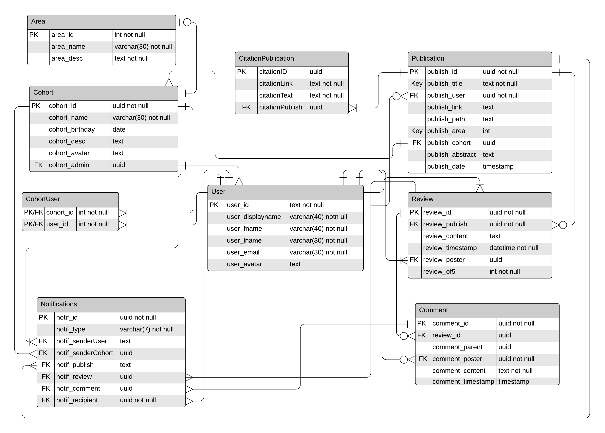

# PeerView Design, Architecture, Rationale

The client-side structure of PeerView follows the Model View Controller (MVC) development architecure. Initially the plan was to have all of the structure in one javascript file `index.js`, but this was scrapped early in development once I realised how large, unmanageable and confusing the file was going to get. The shift benefited development and maintenance of the app greatly, as the mental load of managing the structure of the app was immensely reduced.

## Client side file structure (/client)

* `index.html`: Contains baseline page-setup code and create elements for use by the javascript files. Also includes any necessary code that may arise as plugin/API implementation, such as security or font/styling features.
* `view.js`: Contains the scripting necessary for page element manipulation. Will show and hide page elements such as buttons, screens and sidebars. Processes no data requests, but passes/retrieves data to/from the controller file. Gathers data from page elements and processes accordingly.
* `controller.js` Accepts data input from gathered form elements, formats correctly and applies to the desired api route.
* `elements.js` Grabs all page elements and exports them to `view.js`, to tidy up the code somewhat.
* `style.css` Contains all page styling code.

## Server side file structure (/data)

* `server.js` Contains the setup code for the express server, allowing the app to run on localhost:8080. Also sets up key app functions such as a websocket route, http route.
* `query.js` Contains the database query functions that are called when making requests to the server. Requests written in PSQL. Uses the callback routes defined in `server.js`.
* `db.sql` Contains the PSQL code necessary to setup the app with dummy data. Table declarations are necessary for app functions, but all insertions are for demonstration data. The file is .sql; NPM has packages and extensions to enable it to be interpreted as PSQL code
* `/publish` Contains uploaded/pre-installed publications. These are stored as PDF files, and saved with a unique identifier. The PSQL database stores a reference to the document, not the document itself.
* `/avatar` Stores pictures to be used in the app, in PNG format. It will come with a few pictures pre-placed (logo, placeholder avatar, etc), but any images uploaded to the app for any reason will be stored here with an id. (the PSQL table stores a reference to the picture, not the picture itself)
* `/tests` Stores jest test files used to test functions within the app with example data.

## App Layout

* Database Entity-Relationship Diagram:

* Dependency Diagram:

