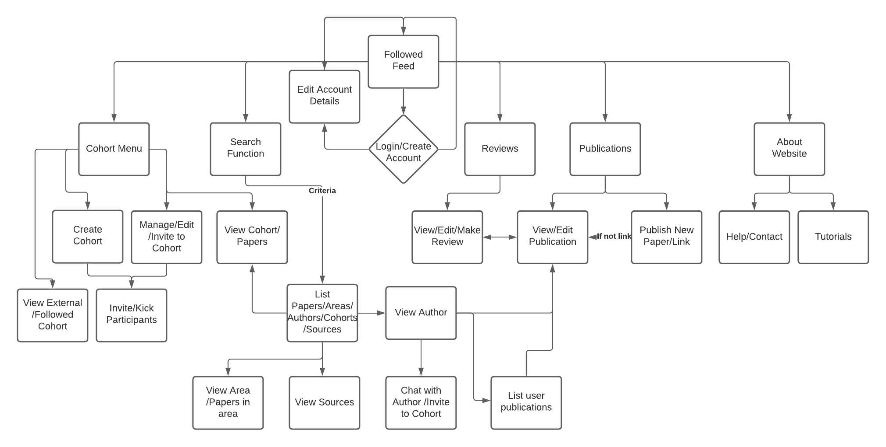

# PeerView Design/Structure

The client side web app will use interactive page elements to send information/responses to the app's server, running on localhost:8080. Contained in this file is the file structure, any ancillary components, data (structures, types, tables, formats) expected to form the final version of the app. These are subject to change throughout development due to changing requirements/features.

## Client side file structure (/dir)

* `index.html`: will contain baseline page-setup code and create elements for use by index.js. will also include any necessary codes that may arise as plugin/API implementation, such as security or maps features. 
* `index.js` will contain all the client side scripting necessary for the webpage to function. likely included in this file: DOM/page manipulation, query-calling, callback functions, data manipulation (user input, server response, etc).
* `style.css` will contain all page styling code. 

## Server side file structure (/data)

* `server.js` will contain the setup code for the express server, allowing the app to run on localhost:8080. it will also setup key app functions such as a websocket route, http route, and maybe more. 
* `query.js` will contain the database query functions that will be called when making requests to the server. the requests will be written in PSQL. they will use the callback routes defined in `routes.js`. 
* `routes.js` will contain the get/post request code necessary to make the websocket and http requests function. expected functions will include ones along the lines of: `/senddoc`(POST pdf to server), `/sendrev`(POST review), `/getacc`(GET account info on login), etc. 
* `db.sql` will contain the PSQL code necessary to setup the app with dummy data. This will primarily be used for demonstration purposes. Whilst the file format will be .sql, NPM has packages and extensions to enable it to be interpreted as PSQL code, so syntax issues shouldn't occur (unless they're my fault)
* `/publish` will contain uploaded/pre-installed publications. These will be stored as PDF files, and saved with a unique identifier. The PSQL database will store a reference to the document, not the document itself (in case where publication is an external link, this will be stored in the database).
* `/img` will store pictures to be used in the app, in either JPEG or PNG formats. It will come with a few pictures pre-placed (logo, placeholder avatar, etc), but any images uploaded to the app for any reason will be stored here with an id. (the PSQL table will store a reference to the picture, not the picture itself)

## App Structure/Layout

Whilst this section will not include UI designs, a layout of the page routes and usable options is displayed below. Notable app features are also mentioned.

## Data

The data for the app will be stored in the below locations.
* Primarily in a PSQL database that will be initiated on the local machine (by running `npm run setup`). Below this section is an ERD of the expected data structures, their types, size limits, etc.
* `data/img` will store pictures to be used in the app, in either JPEG or PNG formats. It will come with a few pictures pre-placed (logo, placeholder avatar, etc), but any images uploaded to the app for any reason will be stored here with an id. (the PSQL table will store a reference to the picture, not the picture itself)
* `data/publish` will contain uploaded/pre-installed publications. These will be stored as PDF files, and saved with a unique identifier. The PSQL database will store a reference to the document, not the document itself (in case where publication is an external link, this will be stored in the database).
* ERD:

